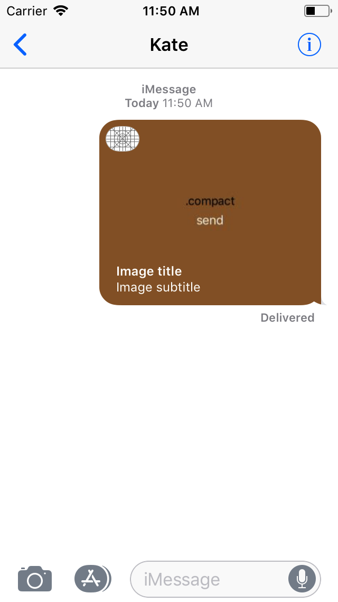
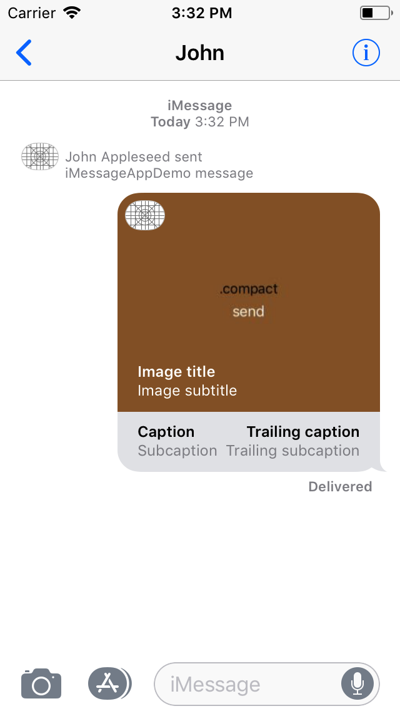

footer: dasdom
build-lists: true

# [fit] iMessage Apps

### Dominik Hauser, dasdom

---

# iMessage Apps

- ähnlich zu "normalen" Apps
	- inkl. SpiteKit & SceneKit
- drei Zustände: 
	- **compact**
	- **expanded**
	- **transcript (iOS 11+)** 

---

# [fit] Demo

---

# [fit] MSMessagesAppViewController

---

# MSMessagesAppViewController

## Activation

```swift
override func willBecomeActive(with conversation: MSConversation) {
                
    let controller: UIViewController
    switch presentationStyle {
    case .compact:
        controller = CompactStyleViewController()
    case .expanded:
        controller = ExpandedStyleViewController()
    default:
        controller = UIViewController()
    }
                
    // View controller container foo 
}
```

---

# MSMessagesAppViewController

## Presentation-Styles

```swift
func requestPresentationStyle(_ presentationStyle: MSMessagesAppPresentationStyle)

func willTransition(to presentationStyle: MSMessagesAppPresentationStyle)
func didTransition(to presentationStyle: MSMessagesAppPresentationStyle)
```

---

### Here be dragons

---

# [fit] MSMessage

---

# MSMessage

`url` und `layout` müssen gesetzt sein.

---

# MSMessage

## URL

```swift
open var url: URL?
```

Die `url` wird verwendet um Daten zu encodieren, die der Extension geschickt wird. Wenn die `url` eine HTTP(S)-URL ist und auf den Gerät keine App existiert, die die Nachricht verarbeiten kann, so wird die URL im Webbrowser geöffnet.

---

# MSMessage

## URL

Beispiel:
```
"?3,1=white&-1,-1,-1,0,2,1=red&remainingRed=31&
remainingWhite=31"
```

---

# MSMessage

## MSMessageLayout

```swift
@NSCopying open var layout: MSMessageLayout?
```

Die UI der Nachricht wird durch eine Subklasse von MSMessageLayout erzeugt.

---

# [fit] MSMessageLayout

```swift
let layout = MSMessageTemplateLayout()
layout.image = image
// you can use layout.mediaFileURL instead of image
layout.caption = "Caption"
layout.imageTitle = "Image title"
layout.imageSubtitle = "Image subtitle"
layout.trailingCaption = "Trailing caption"
layout.subcaption = "Subcaption"
layout.trailingSubcaption = "Trailing subcaption"
```


---

# [fit] MSMessageLayout

```swift
let layout = MSMessageTemplateLayout()
layout.image = image
// you can use layout.mediaFileURL instead of image
layout.caption = nil
layout.imageTitle = "Image title"
layout.imageSubtitle = "Image subtitle"
layout.trailingCaption = nil
layout.subcaption = nil
layout.trailingSubcaption = nil
```



---

# [fit] MSMessageLayout

## MSMessageLiveLayout (seit iOS 11)

```swift
let alternateLayout = MSMessageTemplateLayout()
alternateLayout.image = image
alternateLayout.caption = "Caption"
alternateLayout.imageTitle = "Image title"
alternateLayout.imageSubtitle = "Image subtitle"
alternateLayout.trailingCaption = "Trailing caption"
alternateLayout.subcaption = "Subcaption"
alternateLayout.trailingSubcaption = "Trailing subcaption"

let layout = MSMessageLiveLayout(alternateLayout: alternateLayout)
```

`alternateLayout`: Fallback


---

# [fit] MSMessageLayout

## MSMessageLiveLayout

```swift
override func contentSizeThatFits(_ size: CGSize) -> CGSize {
    return CGSize(width: size.width, height: 100)
}
```


---

# [fit] MSMessageLiveLayout

## Interaktionen

- simple Interaktionen
- vermeide Scrollviews
- keine Tastatureingaben

---

# [fit] Demo

---

# MSMessage

## MSSession

```swift
let layout = MSMessageTemplateLayout()
// ...

let message = MSMessage()
message.url = URL(string: "?foo")
message.layout = layout
```


---

# MSMessage

## MSSession

```swift, [.highlight: 4-5]
let layout = MSMessageTemplateLayout()
// ...

let session = activeConversation?.selectedMessage?.session
let message = MSMessage(session: session ?? MSSession())
message.url = URL(string: "?foo")
message.layout = layout
```



---

# MSMessage

## MSSession

```swift, [.highlight: 8]
let layout = MSMessageTemplateLayout()
// ...

let session = activeConversation?.selectedMessage?.session
let message = MSMessage(session: session ?? MSSession())
message.url = URL(string: "?foo")
message.layout = layout
message.summaryText = "Summery text"
```


---

# MSMessage

## Senden

```swift
self.activeConversation?.insert(message) { error in
    print(error as Any)
}

if #available(iOS 11, *) {
    self.activeConversation?.send(message) { error in
        print(error as Any)
    }
}
```

---

# MSMessage

## Direktes Senden

- App muss sichtbar sein
- nur eine Nachricht pro Interaktion

---

# [fit] Demo

---

# [fit] Namen

---

# Namen

- kein direkter Zugriff
- funktioniert nicht so gut im Simulator

```swift, [.highlight: 2-4]
let layout = MSMessageTemplateLayout()
let uuidString = activeConversation!
    .localParticipantIdentifier.uuidString
layout.caption = "Nachricht von $\(uuidString)"
```


---

# [fit] Danke

---

# MSMessagesAppViewController

## Live-Cycle

```swift
func willBecomeActive(with conversation: MSConversation)
func didBecomeActive(with conversation: MSConversation)

func willResignActive(with conversation: MSConversation)
func didResignActive(with conversation: MSConversation)
```

---

# MSMessagesAppViewController

## Message-Callbacks

```swift
func willSelect(_ message: MSMessage, conversation: MSConversation)
func didSelect(_ message: MSMessage, conversation: MSConversation)

func didReceive(_ message: MSMessage, conversation: MSConversation)

func didStartSending(_ message: MSMessage, conversation: MSConversation)
func didCancelSending(_ message: MSMessage, conversation: MSConversation)
```


